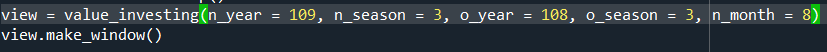
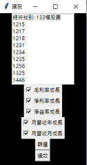

# 台股基本面選股程式

n_year: 想查看的年份

n_season: 想查看的季別

n_month: 想查看的月份

o_year: 想比對的年份

o_season: 想比對的季別

## 範例

*篩選109年Q3較108年Q3之毛利率成長之股票

*篩選109年Q3較108年Q3之淨利率成長之股票

*篩選109年Q3較108年Q3之淨益率成長之股票

*篩選109年8月較108年8月營收成長之股票

*篩選109年8月較109年7月營收成長之股票

